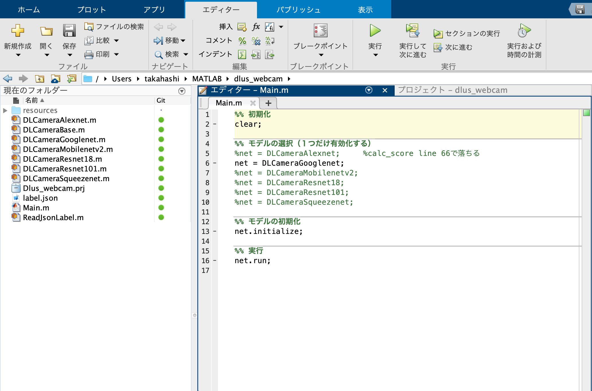

# Deeplearning US webcam tool

## MATLAB Project 導入方法

``新規作成`` -> ``プロジェクト`` -> ``作成元Git`` を選択。


下記条件を入力し、``取得``を選択


項目|内容
---|---
ソース管理ツール|Git
リポジトリのパス|<https://github.com/yasushikobe/dlus_webcam.git>
サンドボックス|任意の新しいフォルダ

``はい``を選択


GitHubより取得されたプロジェクトが開きます。


## 実行方法

プロジェクト画面より、``Main.m`` ソースを開きます。



下記、モデルクラスのうち、一つだけを有効にして、``実行``ボタンを選択します。

```matlab
%% モデルの選択（１つだけ有効化する）
%net = DLCameraAlexnet;     %calc_score line 66で落ちる
net = DLCameraGooglenet;
%net = DLCameraMobilenetv2;
%net = DLCameraResnet18;
%net = DLCameraResnet101;
%net = DLCameraSqueezenet;
```
